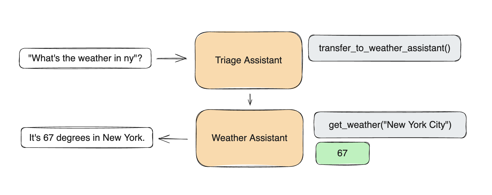

# Contributing: Inception Swarm

As part of an AI Hackathon at Duke University, we developed an innovative addition to the OpenAI Swarm framework - a new "swarm_builder" that dynamically generates new openai swarms based on user prompts. This project allows users to create simple customizable swarms for specific use cases, providing a streamlined and efficient way to set up multi-agent systems without manual setup for each new task. 

Contributors:
- Sakshee Patil
- Siddarth Vinnakota
- Ru Han Wang
- Roxanne Wang 

## Inspiration - A Swarm to build Swarms !!

Building out an idea often takes considerable time, even to just get the basic structure right. With `swarm_builder`, you can quickly prototype various ideas, gaining an immediate sense of their feasibility. **This approach allows you to test around 10 ideas in the time it would typically take to prototype one.** While you might still need to add a few tweaks and some custom code to make your swarm fully functional, we believe having a foundational structure ready within minutes is incredibly helpful. This tool offers a starting point that enables rapid iteration and testing, letting you focus more on refining the swarm’s specific functionality than on setting up the initial framework. And even if you’re not looking to build a system of agents, `swarm_builder` still provides a structured framework and boilerplate code for brainstorming and fleshing out your ideas. You can experiment with different concepts and functionalities, all with minimal setup, allowing for rapid iteration and refinement.

## Pitch

With OpenAI’s recent release of the Swarm framework, we saw an opportunity to explore its potential. Our team brainstormed various ideas, ranging from personalized newsletters to study strategy assistants. But then we thought: why limit ourselves to a single use case? Instead, we envisioned a meta-swarm capable of dynamically generating any type of swarm based on natural language input. This concept pushes the boundaries of multi-agent systems by letting users define their problem, with our meta-swarm doing the rest - creating a personalized, efficient swarm of agents tailored for simple tasks.

The novelty of our project lies in the flexibility of the meta-swarm approach. Rather than building agents for one specific problem, we’ve created a system that generates agents to tackle multiple simple problem, allowing for flexibility in multi-agent solutions. 


## Overview

The `swarm_builder` is a type of inception swarm under the `examples` folder that automatically builds other swarms based on input requirements, allowing users to specify functionality in natural language and generate ready-to-run swarms. These generated swarms can be found in the `inceptions/` folder and can be run directly with minimal user adjustments, making the `swarm_builder` a versatile tool for creating new applications within the OpenAI Swarm framework.

### Features
- **User-Prompted Swarm Creation**: Generates swarms based on user input prompts, translating descriptions into executable configurations.
- **Prebuilt Swarm Examples**: To demonstrate functionality, we've included five sample swarms based on common queries.
- **Streamlit App Support**: Users can interact with the `swarm_builder` through three Streamlit applications for different input types (text, audio, or hybrid):
  - **streamlit_app.py**: Accepts text input.
  - **streamlit_app_audio.py**: Supports audio input.
  - **streamlit_app_hybrid.py**: Supports both text and audio inputs.
- **Automated Boilerplate Generation**: The `swarm_builder` provides approximately 90% of the necessary setup for a new swarm, leaving only minimal user customization to tailor the boilerplate such as minor fixes or entering the API keys for various tools.

### Example Swarms Created Using `swarm_builder`
Below are some sample swarms that demonstrate the capabilities of the `swarm_builder`:
1. **BitcoinInvestingSystem**: Fetches the latest Bitcoin price, 24-hour price change, and recent news for analysis.
2. **spotify_playlist_insights**: Retrieves the top 20 songs in a specified genre and provides a playlist summary with audience insights.
3. **TwitchLiveChecker**: Checks if a given Twitch streamer is currently live, with an option to send a humorous message if they are offline.
4. **TwitterDiscussionSummarizer**: Searches Twitter for recent discussions on a topic and summarizes the main viewpoints.
5. **YouTubeVideoPromotion**: Generates promotional content for a YouTube video, including a catchy title and description based on the video transcript.

### Setup and Running the Swarm
To start using `swarm_builder`, you can run the Streamlit app with one of the following commands:

```bash
streamlit run examples/swarm_builder/streamlit_app.py
streamlit run examples/swarm_builder/streamlit_app_audio.py
streamlit run examples/swarm_builder/streamlit_app_hybrid.py
```

### Environment Variables

To run `swarm_builder` and the generated inception swarms effectively, you'll need to configure several API keys as environment variables. These keys enable access to third-party services that some swarms rely on for gathering information or performing specific actions. Please ensure the required environment variables are set in your environment:

```plaintext
OPENAI_API_KEY=
YOUTUBE_API_KEY=
NEWS_API_KEY=
WEB_SEARCH_KEY=
WEB_SEARCH_ID=
SPOTIFY_CLIENT_ID=
SPOTIFY_CLIENT_SECRET=
TWITCH_CLIENT_ID=
TWITCH_CLIENT_SECRET=
```

#### Important Notes
1. `swarm_builder` Swarm: Some default tools, like web_search, require API keys to function. To use these tools, you’ll need to configure the WEB_SEARCH_KEY AND WEB_SEARCH_ID from Google Custom Search API documentation. Similarly, OPEN_API_KEY is required to run the swarm.
2. Inception Swarms: The example inception swarms already created and stored in the inceptions/ folder may also require additional keys depending on its functionality. For example, `NEWS_API_KEY` would be needed to run the `BitcoinInvestingSystem`
3. Custom Swarms: If you create new swarms using swarm_builder that interact with external APIs, ensure you obtain and set up any necessary API keys as per the instructions provided in the generated swarm. The generated swarm will specify any required API keys, and you should add these before running the inception swarm.


# Swarm (experimental, educational)

An educational framework exploring ergonomic, lightweight multi-agent orchestration.

> [!WARNING]
> Swarm is currently an experimental sample framework intended to explore ergonomic interfaces for multi-agent systems. It is not intended to be used in production, and therefore has no official support. (This also means we will not be reviewing PRs or issues!)
>
> The primary goal of Swarm is to showcase the handoff & routines patterns explored in the [Orchestrating Agents: Handoffs & Routines](https://cookbook.openai.com/examples/orchestrating_agents) cookbook. It is not meant as a standalone library, and is primarily for educational purposes.

## Install

Requires Python 3.10+

```shell
pip install git+ssh://git@github.com/openai/swarm.git
```

or

```shell
pip install git+https://github.com/openai/swarm.git
```

## Usage

```python
from swarm import Swarm, Agent

client = Swarm()

def transfer_to_agent_b():
    return agent_b


agent_a = Agent(
    name="Agent A",
    instructions="You are a helpful agent.",
    functions=[transfer_to_agent_b],
)

agent_b = Agent(
    name="Agent B",
    instructions="Only speak in Haikus.",
)

response = client.run(
    agent=agent_a,
    messages=[{"role": "user", "content": "I want to talk to agent B."}],
)

print(response.messages[-1]["content"])
```

```
Hope glimmers brightly,
New paths converge gracefully,
What can I assist?
```

## Table of Contents

- [Overview](#overview)
- [Examples](#examples)
- [Documentation](#documentation)
  - [Running Swarm](#running-swarm)
  - [Agents](#agents)
  - [Functions](#functions)
  - [Streaming](#streaming)
- [Evaluations](#evaluations)
- [Utils](#utils)

# Overview

Swarm focuses on making agent **coordination** and **execution** lightweight, highly controllable, and easily testable.

It accomplishes this through two primitive abstractions: `Agent`s and **handoffs**. An `Agent` encompasses `instructions` and `tools`, and can at any point choose to hand off a conversation to another `Agent`.

These primitives are powerful enough to express rich dynamics between tools and networks of agents, allowing you to build scalable, real-world solutions while avoiding a steep learning curve.

> [!NOTE]
> Swarm Agents are not related to Assistants in the Assistants API. They are named similarly for convenience, but are otherwise completely unrelated. Swarm is entirely powered by the Chat Completions API and is hence stateless between calls.

## Why Swarm

Swarm explores patterns that are lightweight, scalable, and highly customizable by design. Approaches similar to Swarm are best suited for situations dealing with a large number of independent capabilities and instructions that are difficult to encode into a single prompt.

The Assistants API is a great option for developers looking for fully-hosted threads and built in memory management and retrieval. However, Swarm is an educational resource for developers curious to learn about multi-agent orchestration. Swarm runs (almost) entirely on the client and, much like the Chat Completions API, does not store state between calls.

# Examples

Check out `/examples` for inspiration! Learn more about each one in its README.

- [`basic`](examples/basic): Simple examples of fundamentals like setup, function calling, handoffs, and context variables
- [`triage_agent`](examples/triage_agent): Simple example of setting up a basic triage step to hand off to the right agent
- [`weather_agent`](examples/weather_agent): Simple example of function calling
- [`airline`](examples/airline): A multi-agent setup for handling different customer service requests in an airline context.
- [`support_bot`](examples/support_bot): A customer service bot which includes a user interface agent and a help center agent with several tools
- [`personal_shopper`](examples/personal_shopper): A personal shopping agent that can help with making sales and refunding orders

# Documentation



## Running Swarm

Start by instantiating a Swarm client (which internally just instantiates an `OpenAI` client).

```python
from swarm import Swarm

client = Swarm()
```

### `client.run()`

Swarm's `run()` function is analogous to the `chat.completions.create()` function in the Chat Completions API – it takes `messages` and returns `messages` and saves no state between calls. Importantly, however, it also handles Agent function execution, hand-offs, context variable references, and can take multiple turns before returning to the user.

At its core, Swarm's `client.run()` implements the following loop:

1. Get a completion from the current Agent
2. Execute tool calls and append results
3. Switch Agent if necessary
4. Update context variables, if necessary
5. If no new function calls, return

#### Arguments

| Argument              | Type    | Description                                                                                                                                            | Default        |
| --------------------- | ------- | ------------------------------------------------------------------------------------------------------------------------------------------------------ | -------------- |
| **agent**             | `Agent` | The (initial) agent to be called.                                                                                                                      | (required)     |
| **messages**          | `List`  | A list of message objects, identical to [Chat Completions `messages`](https://platform.openai.com/docs/api-reference/chat/create#chat-create-messages) | (required)     |
| **context_variables** | `dict`  | A dictionary of additional context variables, available to functions and Agent instructions                                                            | `{}`           |
| **max_turns**         | `int`   | The maximum number of conversational turns allowed                                                                                                     | `float("inf")` |
| **model_override**    | `str`   | An optional string to override the model being used by an Agent                                                                                        | `None`         |
| **execute_tools**     | `bool`  | If `False`, interrupt execution and immediately returns `tool_calls` message when an Agent tries to call a function                                    | `True`         |
| **stream**            | `bool`  | If `True`, enables streaming responses                                                                                                                 | `False`        |
| **debug**             | `bool`  | If `True`, enables debug logging                                                                                                                       | `False`        |

Once `client.run()` is finished (after potentially multiple calls to agents and tools) it will return a `Response` containing all the relevant updated state. Specifically, the new `messages`, the last `Agent` to be called, and the most up-to-date `context_variables`. You can pass these values (plus new user messages) in to your next execution of `client.run()` to continue the interaction where it left off – much like `chat.completions.create()`. (The `run_demo_loop` function implements an example of a full execution loop in `/swarm/repl/repl.py`.)

#### `Response` Fields

| Field                 | Type    | Description                                                                                                                                                                                                                                                                  |
| --------------------- | ------- | ---------------------------------------------------------------------------------------------------------------------------------------------------------------------------------------------------------------------------------------------------------------------------- |
| **messages**          | `List`  | A list of message objects generated during the conversation. Very similar to [Chat Completions `messages`](https://platform.openai.com/docs/api-reference/chat/create#chat-create-messages), but with a `sender` field indicating which `Agent` the message originated from. |
| **agent**             | `Agent` | The last agent to handle a message.                                                                                                                                                                                                                                          |
| **context_variables** | `dict`  | The same as the input variables, plus any changes.                                                                                                                                                                                                                           |

## Agents

An `Agent` simply encapsulates a set of `instructions` with a set of `functions` (plus some additional settings below), and has the capability to hand off execution to another `Agent`.

While it's tempting to personify an `Agent` as "someone who does X", it can also be used to represent a very specific workflow or step defined by a set of `instructions` and `functions` (e.g. a set of steps, a complex retrieval, single step of data transformation, etc). This allows `Agent`s to be composed into a network of "agents", "workflows", and "tasks", all represented by the same primitive.

## `Agent` Fields

| Field            | Type                     | Description                                                                   | Default                      |
| ---------------- | ------------------------ | ----------------------------------------------------------------------------- | ---------------------------- |
| **name**         | `str`                    | The name of the agent.                                                        | `"Agent"`                    |
| **model**        | `str`                    | The model to be used by the agent.                                            | `"gpt-4o"`                   |
| **instructions** | `str` or `func() -> str` | Instructions for the agent, can be a string or a callable returning a string. | `"You are a helpful agent."` |
| **functions**    | `List`                   | A list of functions that the agent can call.                                  | `[]`                         |
| **tool_choice**  | `str`                    | The tool choice for the agent, if any.                                        | `None`                       |

### Instructions

`Agent` `instructions` are directly converted into the `system` prompt of a conversation (as the first message). Only the `instructions` of the active `Agent` will be present at any given time (e.g. if there is an `Agent` handoff, the `system` prompt will change, but the chat history will not.)

```python
agent = Agent(
   instructions="You are a helpful agent."
)
```

The `instructions` can either be a regular `str`, or a function that returns a `str`. The function can optionally receive a `context_variables` parameter, which will be populated by the `context_variables` passed into `client.run()`.

```python
def instructions(context_variables):
   user_name = context_variables["user_name"]
   return f"Help the user, {user_name}, do whatever they want."

agent = Agent(
   instructions=instructions
)
response = client.run(
   agent=agent,
   messages=[{"role":"user", "content": "Hi!"}],
   context_variables={"user_name":"John"}
)
print(response.messages[-1]["content"])
```

```
Hi John, how can I assist you today?
```

## Functions

- Swarm `Agent`s can call python functions directly.
- Function should usually return a `str` (values will be attempted to be cast as a `str`).
- If a function returns an `Agent`, execution will be transferred to that `Agent`.
- If a function defines a `context_variables` parameter, it will be populated by the `context_variables` passed into `client.run()`.

```python
def greet(context_variables, language):
   user_name = context_variables["user_name"]
   greeting = "Hola" if language.lower() == "spanish" else "Hello"
   print(f"{greeting}, {user_name}!")
   return "Done"

agent = Agent(
   functions=[greet]
)

client.run(
   agent=agent,
   messages=[{"role": "user", "content": "Usa greet() por favor."}],
   context_variables={"user_name": "John"}
)
```

```
Hola, John!
```

- If an `Agent` function call has an error (missing function, wrong argument, error) an error response will be appended to the chat so the `Agent` can recover gracefully.
- If multiple functions are called by the `Agent`, they will be executed in that order.

### Handoffs and Updating Context Variables

An `Agent` can hand off to another `Agent` by returning it in a `function`.

```python
sales_agent = Agent(name="Sales Agent")

def transfer_to_sales():
   return sales_agent

agent = Agent(functions=[transfer_to_sales])

response = client.run(agent, [{"role":"user", "content":"Transfer me to sales."}])
print(response.agent.name)
```

```
Sales Agent
```

It can also update the `context_variables` by returning a more complete `Result` object. This can also contain a `value` and an `agent`, in case you want a single function to return a value, update the agent, and update the context variables (or any subset of the three).

```python
sales_agent = Agent(name="Sales Agent")

def talk_to_sales():
   print("Hello, World!")
   return Result(
       value="Done",
       agent=sales_agent,
       context_variables={"department": "sales"}
   )

agent = Agent(functions=[talk_to_sales])

response = client.run(
   agent=agent,
   messages=[{"role": "user", "content": "Transfer me to sales"}],
   context_variables={"user_name": "John"}
)
print(response.agent.name)
print(response.context_variables)
```

```
Sales Agent
{'department': 'sales', 'user_name': 'John'}
```

> [!NOTE]
> If an `Agent` calls multiple functions to hand-off to an `Agent`, only the last handoff function will be used.

### Function Schemas

Swarm automatically converts functions into a JSON Schema that is passed into Chat Completions `tools`.

- Docstrings are turned into the function `description`.
- Parameters without default values are set to `required`.
- Type hints are mapped to the parameter's `type` (and default to `string`).
- Per-parameter descriptions are not explicitly supported, but should work similarly if just added in the docstring. (In the future docstring argument parsing may be added.)

```python
def greet(name, age: int, location: str = "New York"):
   """Greets the user. Make sure to get their name and age before calling.

   Args:
      name: Name of the user.
      age: Age of the user.
      location: Best place on earth.
   """
   print(f"Hello {name}, glad you are {age} in {location}!")
```

```javascript
{
   "type": "function",
   "function": {
      "name": "greet",
      "description": "Greets the user. Make sure to get their name and age before calling.\n\nArgs:\n   name: Name of the user.\n   age: Age of the user.\n   location: Best place on earth.",
      "parameters": {
         "type": "object",
         "properties": {
            "name": {"type": "string"},
            "age": {"type": "integer"},
            "location": {"type": "string"}
         },
         "required": ["name", "age"]
      }
   }
}
```

## Streaming

```python
stream = client.run(agent, messages, stream=True)
for chunk in stream:
   print(chunk)
```

Uses the same events as [Chat Completions API streaming](https://platform.openai.com/docs/api-reference/streaming). See `process_and_print_streaming_response` in `/swarm/repl/repl.py` as an example.

Two new event types have been added:

- `{"delim":"start"}` and `{"delim":"end"}`, to signal each time an `Agent` handles a single message (response or function call). This helps identify switches between `Agent`s.
- `{"response": Response}` will return a `Response` object at the end of a stream with the aggregated (complete) response, for convenience.

# Evaluations

Evaluations are crucial to any project, and we encourage developers to bring their own eval suites to test the performance of their swarms. For reference, we have some examples for how to eval swarm in the `airline`, `weather_agent` and `triage_agent` quickstart examples. See the READMEs for more details.

# Utils

Use the `run_demo_loop` to test out your swarm! This will run a REPL on your command line. Supports streaming.

```python
from swarm.repl import run_demo_loop
...
run_demo_loop(agent, stream=True)
```

# Core Contributors

- Ilan Bigio - [ibigio](https://github.com/ibigio)
- James Hills - [jhills20](https://github.com/jhills20)
- Shyamal Anadkat - [shyamal-anadkat](https://github.com/shyamal-anadkat)
- Charu Jaiswal - [charuj](https://github.com/charuj)
- Colin Jarvis - [colin-openai](https://github.com/colin-openai)
- Katia Gil Guzman - [katia-openai](https://github.com/katia-openai)
